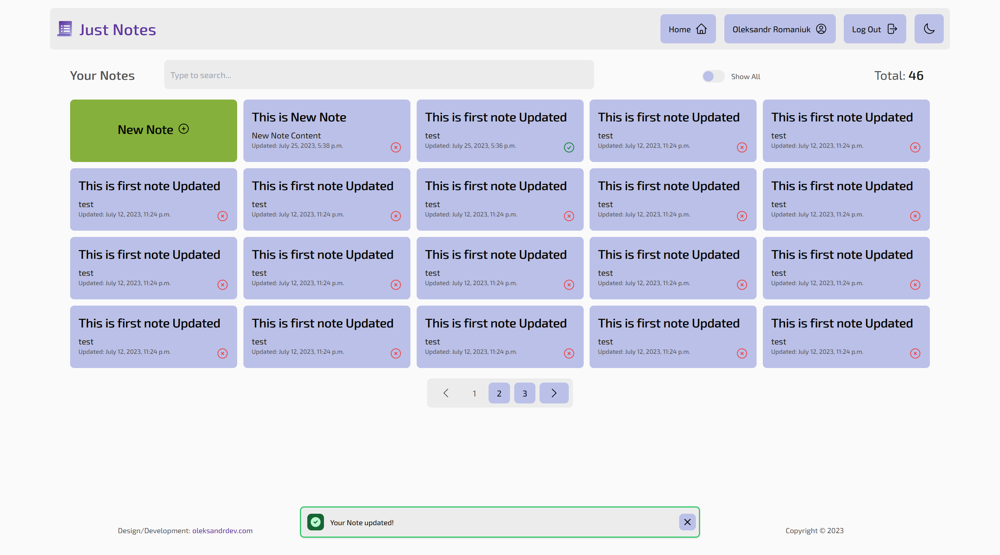
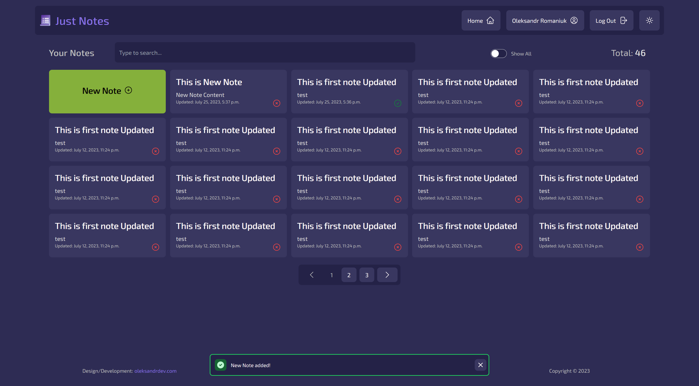

# Just Notes

## Simple Notes App

Light Theme            |  Dark Theme
:-------------------------:|:-------------------------:
  |  


## Deployed with [Fly.io](https//:fly.io) - [just-notes.fly.dev](https://just-notes.fly.dev/)

### Dummy Credentials:
```
email: dummy@mail.com
password: dummypassword
```

### Created using Django, HTMX, Alpine.js, TailwindCSS

### Functionality:

- [x] Register/Login
- [x] Profile Page:
    - [x] Profile Details update
- [x] Home (Notes) Page:
    - [x] List All Notes
        - [x] All Notes counter
    - [x] Create a new Note
    - [x] Update Note
    - [x] Delete Note
    - [x] Bulk Actions on Notes:
        - [x] Selected Notes counter
        - [x] Select All Notes option
        - [x] Bulk Delete selected Notes
        - [x] Bulk Change 'Completed' Status on selected Notes
    - [x] Pagination
    - [x] Live Search
    - [x] Filter by `is_completed` status
- [ ] Analytics Page (WIP):
    - [x] Base Analytics about Completed Notes per Month
    - [ ] ...
- [x] Toasts Application to show Django Messages with HTMX
    - [x] Auto-dismissed Toasts
    - [x] Manual Toast dismiss
- [x] Dark/Light mode:
    - [x] Manual switching
    - [x] Detecting system theme switching

### Stack
- `Django` for the backend server
- `TailwingCSS` for frontend styling
- `HTMX` to make a frontend dynamic and interactive like a "reactive" apps
- `Alpine.js` for state management and frontend interactivity
- `JavaScript` for minor but important for usability(interactivity) things: theme switching, toasts, etc

#### Steps to run locally:
1. create a virtual environment
2. install requirements:  
    ```pip install -r requirements.txt```
3. run migrations:  
    ```python manage.py migrate```
4. start server:  
    ```python manage.py runserver```
